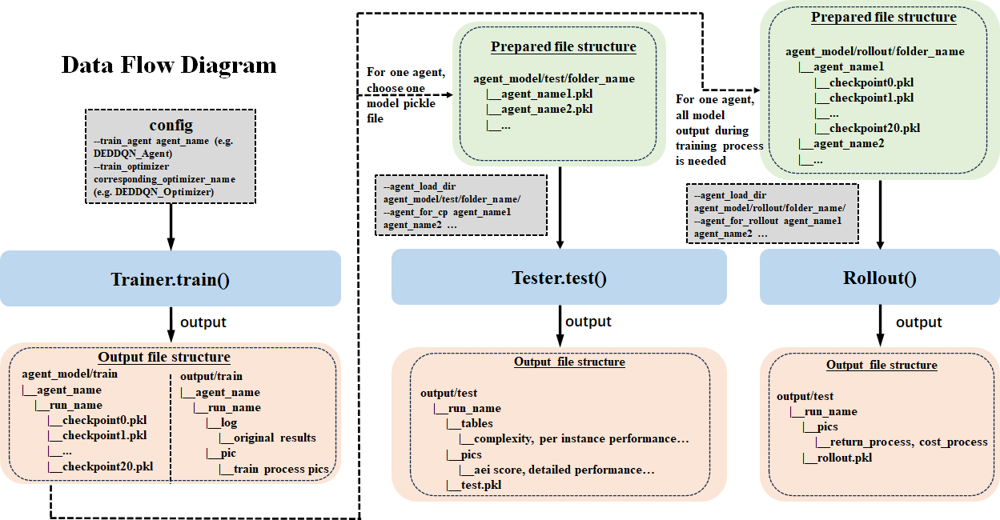

# MetaBox: A Benchmark Platform for Meta-Black-Box Optimization with Reinforcement Learning

This is a **reinforcement learning benchmark platform** for benchmarking and MetaBBO-RL methods. You can develop your own MetaBBO-RL approach and complare it with baseline approaches built-in following the **Train-Test-Log** philosophy automated by MetaBox.

## Overview

`MetaBox` can be divided into six modules: **Template, Test suites, Baseline Library, Trainer, Tester and Logger.**

* `Template` comprises two main components: the **meta-level RL agent** and the **lower-level optimizer**, which provides a unified interface protocol for users to develop their own MetaBBO-RL with ease. 
* `Test suites` are used for generating training and testing sets, including **Synthetic**, **Noisy-Synthetic**, and **Protein-Docking**.
* `Baseline Library` comprises proposed algorithms including **MetaBBO-RL**, **MetaBBO-SL** and **classic** optimizers that we implemented for comparison study.
* `Trainer` **manages the entire learning process** of the agent by building environments consisting of a backbone optimizer and a problem sampled from train set and letting the agent interact with environments sequentially.
* `Tester` is used to **evaluate** the optimization performance of the MetaBBO-RL. By using the test set to test the baselines and the trained MetaBBO agent, it produces test log for logger to generate statistic test results.
* `Logger` implements multiple interfaces for **displaying** the logs of the training process and the results of the testing process, which facilitates the improvement of the training process and the observation of MetaBBO-RL's performance.

**Data Stream**

When using MetaBox, after the training interface `Trainer.train()` called, 21 pickle files of training agent in different training process and pictures of training process will be output to `src/agent_model/train` and `src/output/train` respectively. If you want to compare performance among baselines built-in or your own approach, `Tester.test` is needed to be called. For those learnable agent in your comparing list, you need to first collect these agent model pickle files (one agent one file) to a specific folder, where the agent model file may have been outputed by `Trainer.train()` and you can find that and then copy it to the right place. When `Tester.test()` finished, tables containing per-instance result and algorithm complexity, pictures depicting comparison results or singal approach performance, original testing result will be output to `src/output/test`. In addition, for `Rollout` interface, before that you need to collect all of checkpoints of all of learning agents which can be copy from output of `Trainer.train()`. When `Rollout` finished, pictures containing average return process and optimization cost process will be output to `src/output/rollout` and the original data file will also be saved.

## Datasets and Baselines

- [Datasets](Datasets.md)
- [Baseline Library](Baselines.md)

## **Basic Tutorials**

- [Fit your own MetaBBO-RL into MetaBox](Customization.md)
- [Run Experiment](RunExperiment.md)
- [Training](Train.md)
- [Rollout](Rollout.md)
- [Testing](Test.md)
